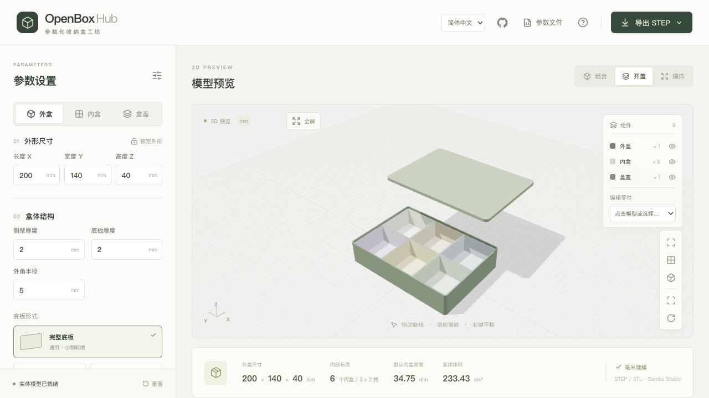
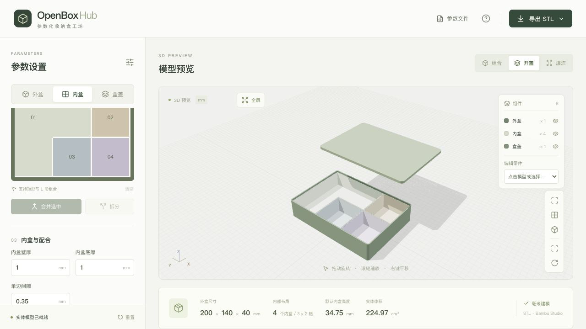
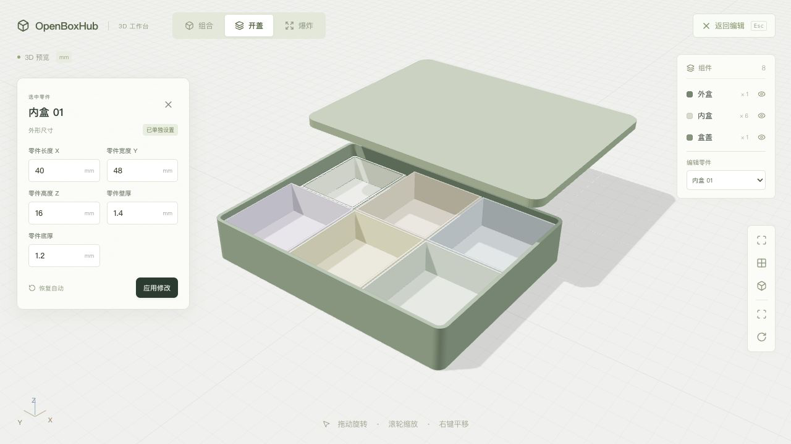
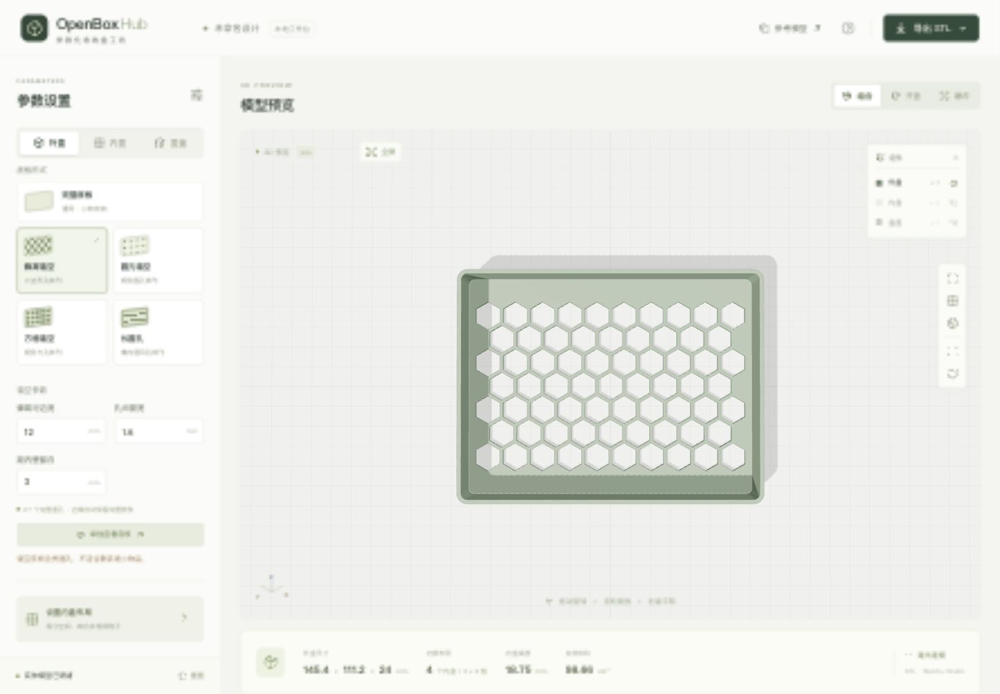
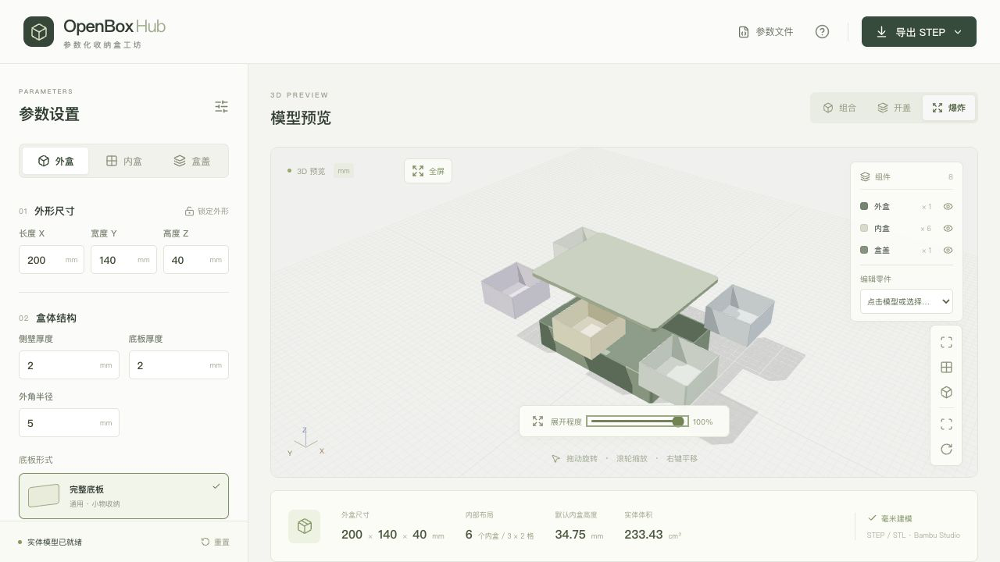
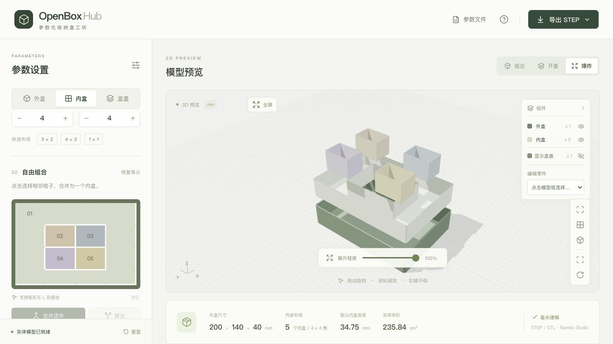
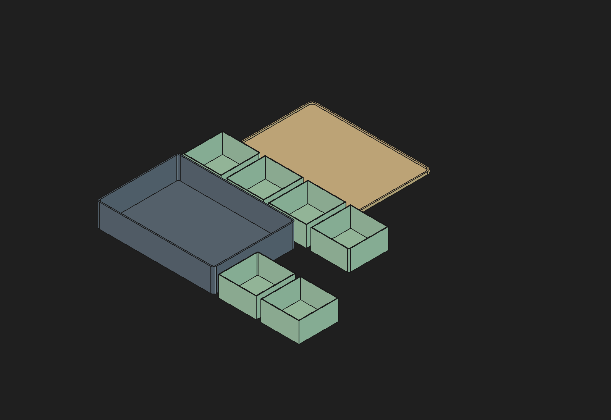

[简体中文](README.md) · [English](README.en.md)

<div align="center">
  
  <h1>OpenBoxHub</h1>
  <p><strong>A parametric storage box workshop in your browser</strong></p>
  <p>Set dimensions · Arrange inserts · Export for printing</p>
  <p>
    <a href="https://geekheart.github.io/OpenBoxHub/?lang=en"><strong>Open the online workshop →</strong></a>
    &nbsp; · &nbsp;
    <a href="#quick-start">Run locally</a>
    &nbsp; · &nbsp;
    <a href="#deployment">Deployment</a>
  </p>
  <p><code>Frontend only</code> &nbsp; <code>Individual part editing</code> &nbsp; <code>360° preview</code> &nbsp; <code>CAD STEP / FreeCAD / STL</code></p>
</div>



Set the outer dimensions, divide the interior into integer rows and columns, merge adjacent cells, choose a base and lid, then download the parts for slicing in Bambu Studio.

The page opens directly in the parameter editor. The default outer dimensions are **200 × 140 × 40 mm**, based on the 20 × 14 × 4 cm size of a ready-made mailer box: [EPACKBOX specification](https://epackbox.com/products/mail-box-aircraft-box). This is a starting size, not an industry standard.

Modeling, preview and file generation happen entirely in your browser. Save and restore designs with JSON files. No design history is stored in the browser; refreshing returns to the default design.

The interface defaults to Simplified Chinese. Select **English** in the header or use the [English workshop link](https://geekheart.github.io/OpenBoxHub/?lang=en). Switching languages retains the current design, selection and preview state, and changes only the interface and URL. The GitHub icon opens this repository. The shared screenshots below show the Chinese interface.

## Features

| Feature | What it does |
| --- | --- |
| Parametric outer box | Adjust length, width, height, wall/base thickness and corner radius; lock the outer dimensions while designing the interior |
| Removable inserts | Divide into 1–12 rows × 1–12 columns; merge cells sharing an edge into rectangular, L-shaped or ring-shaped inserts, and split them again |
| Configurable base | Solid, honeycomb, round, square or slotted holes; adjust hole width, rib width, inner margin and overall slot length |
| Interchangeable lids | Open storage, an overlapping lid or an inset lid; changing only the lid type preserves the box and insert layout |
| Full-screen 3D preview | Rotate, zoom and pan; assembly, open-lid and exploded views; nested inserts separate into layers along collision-checked paths |
| Assembly inspection | Toggle component visibility, hide the lid, make the outer box transparent, auto-rotate, use top/front views and select parts |
| Individual part editing | Edit each part’s length, width, height, wall and base thickness; nonrectangular inserts show bounding dimensions |
| Design files | Import/export JSON containing parameters, merged groups, individual settings and the outer dimension lock |
| Local downloads | Analytic STEP by default, plus STL and FreeCAD macros; a complete flat-layout file, a ZIP of separate parts, or one part |
| Further editing in FreeCAD | Native sketches, pads and pockets, with the option to save an editable FCStd project |

## From dimensions to structure

### Divide first, then merge

After configuring the outer box, open **Inserts** and adjust **Columns** and **Rows**. Select cells that share an edge and choose **Merge selected** to create a removable insert. Merging actually removes the walls between cells. Select a merged region and choose **Split** to divide it again. Cells that only touch at corners cannot be merged.



Changing the row or column count resets merged groups and custom insert dimensions. Merging or splitting only clears settings for the affected inserts; other inserts retain their settings.

### Adjust each part independently

Click a part in the 3D model or select it under **Edit part**. Change its length, width, height, wall thickness and base thickness, then choose **Apply changes**. Locked outer dimensions cannot be edited until you unlock them in the outer box panel.



L-shaped, ring-shaped and other nonrectangular inserts show the size of their bounding rectangle. Editing length or width scales the original outline about its center while preserving the merged shape. Lid height includes the plate and locating skirt; its base thickness means plate thickness. **Restore automatic** returns inserts and lids to dimensions derived from the global parameters. Intersections and out-of-bounds dimensions produce an error.

### Configure the base

Choose a base pattern under **Outer box**. The holes are created with solid boolean operations and remain through-holes in exported STEP and STL files. Hole width, minimum rib width and the margin from the inner wall are adjustable. Only complete holes are kept, avoiding partial openings at the edges. Use **Inspect base** to see the pattern clearly.



Perforation applies to the outer box base; insert bases remain solid. If no complete holes fit, the interface explains that a solid base was retained. Overly dense patterns ask you to adjust the parameters.

### Inspect the assembly from any angle

The default layout includes the parameter panel and 3D preview. Choose **Full screen** to fill the window; press `Esc` or choose **Back to editor** to return. Drag to rotate, scroll to zoom and right-drag to pan. Switch between **Assembly**, **Open lid** and **Exploded** views. The exploded amount starts at **100%** and can be adjusted with a slider.



The animation first lifts the lid, then removes inserts vertically, then moves them outward. Ordinary grid inserts stay on the same layer. Inserts nested inside rings, multiple nested shapes, or U/C-shaped cavities first rise to a higher layer before fully separating. Concentric inserts also receive separate layers. The program checks the entire motion path. Switching modes or reversing mid-animation passes through shared safe positions before continuing.



Use the **Lid** button in the component panel to toggle its visibility. Camera framing excludes hidden parts, but exported files still include the lid.

An overlapping lid fits around the box; an inset lid uses a skirt inside the cavity. Automatically generated inserts reserve `skirt depth + lid clearance per side` above them for every lid type. Custom insert heights must remain within the available height below this clearance and pass assembly checks.

## Save and restore designs

Open **Design file** and choose **Download JSON**. The file contains the outer box, base, lid, cell groups, individual part parameters and outer dimension lock.


**Choose design file** imports a saved JSON file. You can also import `design.json` or `manifest.json` extracted from an exported ZIP. The current design is replaced only after the file passes format and modeling validation. A failed import preserves the existing design.

The page does not retain design history. Download the design file before leaving or refreshing if you want to keep your work. Language switching does not change JSON keys, units, filenames, stable part IDs or the design format.

Example designs: [default 200 × 140 × 40 mm, 3 columns × 2 rows](examples/default_3x2/design.json); [L-shaped merge with inset lid, 145.4 × 111.2 × 24 mm](examples/merged_L_inset/design.json).

## Export and print

The default is a **complete flat-layout STEP file**, with each part retained as a separate solid. Switch to STL or a FreeCAD macro, and choose a complete file, separate-part ZIP, or individual part. Files are generated in the browser; choose **Download file** when ready.


STEP uses [Replicad / OpenCascade](https://replicad.xyz/) to rebuild analytic CAD solids from parametric profiles, extrusions and booleans. It preserves planes and continuous surfaces without conversion through STL. Rounded corners and round holes retain arcs and cylindrical surfaces; nonuniform scaling can produce ellipses or splines. STEP does not carry FreeCAD feature history. Choose **FreeCAD** for editable modeling steps.

**Continue designing in FreeCAD:**

1. Choose **FreeCAD** and download the `.FCMacro`.
2. Open the macro in FreeCAD 1.0 or newer, then select and run it under **Macro → Macros…**. It creates a new document with native sketches, Pads and Pockets for each part.
3. Edit `Height` and `BottomThickness` in each part’s parameter set, or edit sketches and later features. Expressions update related steps. To adjust an individual extrusion length directly, first remove that property’s expression.
4. Save as `.FCStd` and reopen the project later without rerunning the macro. Profiles come from the current design; the file does not contain the web app’s grid-merging operation history. To change the grid layout, import your JSON into OpenBoxHub.



Try the [default 3 × 2 FreeCAD project](examples/default_3x2/OpenBoxHub.FCStd). Each box has its own parameter set and modeling steps. Save JSON as well if you want to continue editing in OpenBoxHub.

A ZIP contains:

- Separate STEP, binary STL or FreeCAD macro files for the outer box, inserts and lid, depending on the selected format. A FreeCAD ZIP also includes a complete flat-layout macro.
- `design.json`: reimportable parameters, groups and individual settings.
- `manifest.json`: parameters, individual settings, part information and assembly transforms; it can also be imported.
- `README.txt`: printing orientation, units and slicing instructions. Exported metadata and canonical part names retain the existing format independently of the interface language.

**In Bambu Studio:**

1. Import STEP or STL; extract ZIP files first. A complete file can be split into **separate objects** for arrangement.
2. Use millimeters and 100% scale. Repack the parts for the actual printer’s build plate.
3. Choose your printer, material and slicing settings, inspect the preview, then print.

Every exported part rests at `Z = 0`: boxes face open-side up; the lid plate faces down with the locating skirt up. Exploded amount, camera position, visibility and transparency affect only the preview, never the exported geometry. The complete flat layout is generic and still needs a build-plate size check in the slicer.

STEP records millimeter units. STL does not record units, so select millimeters on import. Neither contains printer or material settings. The default lid clearance is **0.25 mm per side**; insert clearance is **0.35 mm per side**, giving **0.70 mm** between adjacent inserts with automatic dimensions. These values are starting points for test prints, not guaranteed fits.

**No physical test print has been performed.** Check the fit with a small test piece for your printer, material and slicing settings.

## Quick start

Use **Node.js 24** and **pnpm 11.19.0**.

```bash
git clone https://github.com/geekheart/OpenBoxHub.git
cd OpenBoxHub
npm install --global pnpm@11.19.0
pnpm install --frozen-lockfile
pnpm dev --port 5173
```

Open the URL printed in the terminal, usually [http://127.0.0.1:5173/](http://127.0.0.1:5173/). Add `?lang=en` for English. On macOS, after installing dependencies, you can also double-click `启动盒子工坊.command`. Keep its terminal window open while using the app.

## Deployment

### GitHub Pages

Live workshop: **[geekheart.github.io/OpenBoxHub](https://geekheart.github.io/OpenBoxHub/?lang=en)**

The [GitHub Actions workflow](.github/workflows/pages.yml) installs locked dependencies, runs tests, builds, and publishes that commit’s `dist/` after a push to `main` or any tag. You can also manually run it from the repository’s **Actions** page with `main` or a tag selected. Pull requests only run tests and builds.

Example tag deployment, with the version adjusted as needed:

```bash
git tag v1.0.2
git push origin v1.0.2
```

A local tag alone does not deploy; push it to GitHub. The tagged commit must contain the workflow.

To deploy your own copy:

1. Fork this repository or push it to your own GitHub repository.
2. Under **Settings → Pages → Build and deployment**, set **Source** to **GitHub Actions**.
3. In **Settings → Environments → github-pages**, allow the `main` branch and the `*` and `**/*` tag-name rules.
4. Enable and run the workflow from **Actions**, or push to `main` or push a tag.
5. Wait for the workflow to finish, then open the published URL from **Settings → Pages**.

Vite uses relative asset paths for repository subdirectory deployment. Workers and Manifold/OpenCascade WASM are included in the build. The CAD kernel loads only when exporting STEP or FreeCAD.

### Any static server

```bash
pnpm install --frozen-lockfile
pnpm build
```

Upload **all contents of `dist/`**, preserving the directory structure. Serve over HTTP/HTTPS with `.wasm` files using the `application/wasm` MIME type.

Inspect the production build locally:

```bash
pnpm preview --port 4173
```

Or use a standard static server:

```bash
python3 -m http.server 8080 --bind 127.0.0.1 --directory dist
```

Open the page through HTTP/HTTPS. Double-clicking `dist/index.html` with a `file://` URL may prevent the browser from loading Workers or WASM.

## Technology and development

| Technology | Responsibility |
| --- | --- |
| [React](https://react.dev/) + [TypeScript](https://www.typescriptlang.org/) + [Vite](https://vite.dev/) | Parameter UI, state and static builds |
| [Three.js](https://threejs.org/) + OrbitControls | Real-time 3D, camera controls and assembly animation |
| [Manifold WASM](https://manifoldcad.org/) | Profile merging, offsets, clipping and solid booleans that produce closed meshes |
| [Replicad / OpenCascade WASM](https://replicad.xyz/) | Analytic CAD solids, STEP output and FreeCAD sketch profiles |
| Web Workers | Background modeling, motion-path collision checks and file generation |
| [JSZip](https://stuk.github.io/jszip/) | Browser packaging of CAD/STL parts, FreeCAD macros and manifests |

```text
src/
├── App.tsx              # Parameters, merged groups, UI and downloads
├── Language.tsx         # Language context, URL switching and GitHub link
├── i18n.ts              # Interpolation and diagnostic display translation
├── translations.json    # Chinese/English message catalog
├── PartInspector.tsx    # Individual part dimensions and thickness
├── NumberField.tsx      # Numeric input
├── Scene.tsx            # Three.js scene, camera and assembly animation
├── geometry.ts          # Parameter validation and Manifold modeling
├── geometry.worker.ts   # WASM initialization, modeling and path planning
├── collision.ts         # Continuous collision checks using solid sections
├── motion.ts            # Shared motion paths, stages and reversal
├── design.ts            # Design JSON validation, import and export
├── cad.ts               # Analytic CAD solids and modeling steps
├── cad-types.ts         # Portable profile / extrusion / cut steps
├── step.ts              # Analytic solid STEP export
├── freecad.ts           # Native FreeCAD sketches and feature-tree macros
├── export.worker.ts     # Background file generation
├── export.ts            # Formats, STL, flat layouts, ZIP and manifests
└── types.ts             # Parameters, defaults and model data
tests/                  # Geometry, assembly, motion, design, export and i18n checks
docs/images/            # Screenshots of the running interface
.github/workflows/      # GitHub Pages deployment
```

```bash
pnpm test     # Geometry, export and localization tests
pnpm build    # TypeScript checks and production build
```

Tests cover closed directed mesh edges, Float32 welding and degenerate faces, dimensions and volume, assembly and motion-path collisions, individual editing, interchangeable lids, L/ring layouts, perforation, JSON round trips and rejected input, plus offline STEP/STL/ZIP generation. Localization tests cover URL selection, rendered interface labels, diagnostics and preservation of filenames and design data.

Independent CAD validation uses actual FreeCAD: `scripts/verify-cad-step.py` reads STEP to inspect solids, surfaces and dimensions, and performs extrusion and subtraction. `scripts/verify-freecad.py` runs the macro, edits height and base thickness, saves and reopens the project, and recomputes it. FreeCAD is for development validation and further CAD editing; it is not required to run the website.

After installing FreeCAD, generate fixtures and run validation with a Python interpreter that can import the `FreeCAD` module:

```bash
node --import tsx scripts/generate-step-fixtures.ts
python scripts/verify-cad-step.py test-results/cad-validation/expected.json
python scripts/verify-freecad.py test-results/cad-validation
```

See [AGENTS.md](AGENTS.md) for maintenance conventions and [third-party notices](public/third-party/README.txt) for CAD dependencies, sources and licenses.

## Version and license

Version **1.0.2** adds the bilingual interface, GitHub link, English documentation and project license. See the [changelog](CHANGELOG.md) and [1.0.2 release notes](docs/releases/v1.0.2.md).

The project code is licensed under the [MIT License](LICENSE), Copyright (c) 2026 geekheart. Third-party libraries and CAD kernels retain their own licenses; the project’s MIT license does not replace their requirements. Replicad is MIT-licensed and replicad-opencascadejs is LGPL-2.1-only. Their sources, licenses and the OCCT exception are distributed with the static website; see the [third-party notices](public/third-party/README.txt).

During `pnpm build`, Vite reads the root `LICENSE` and emits `dist/LICENSE`; no second license text is maintained. The third-party licenses and source notices in `public/third-party/` are also copied to `dist/third-party/`. Keep these files when deploying the build.
