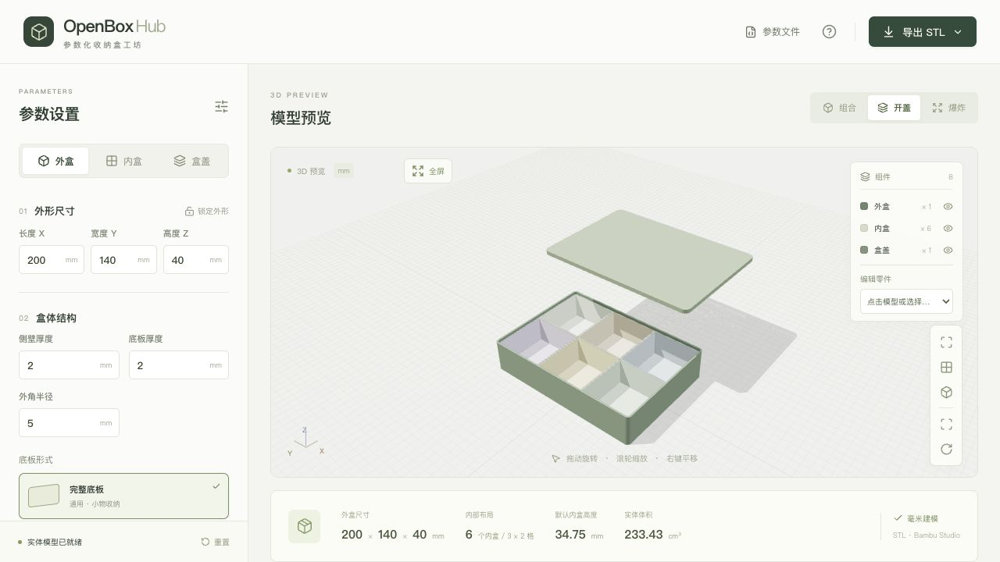
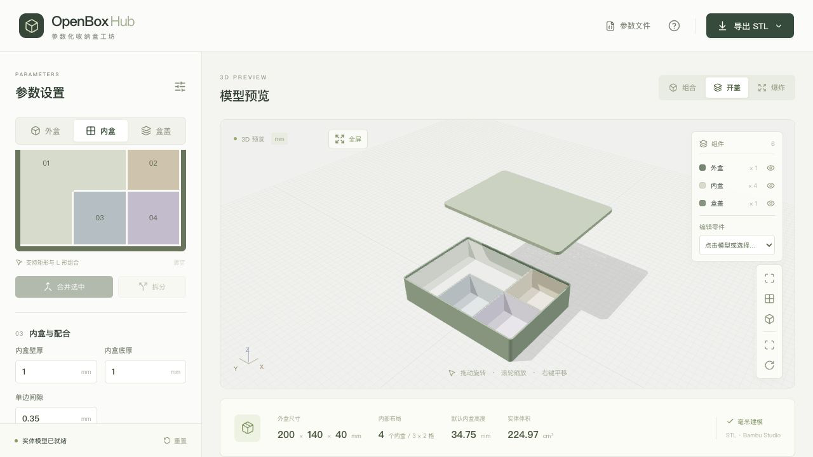
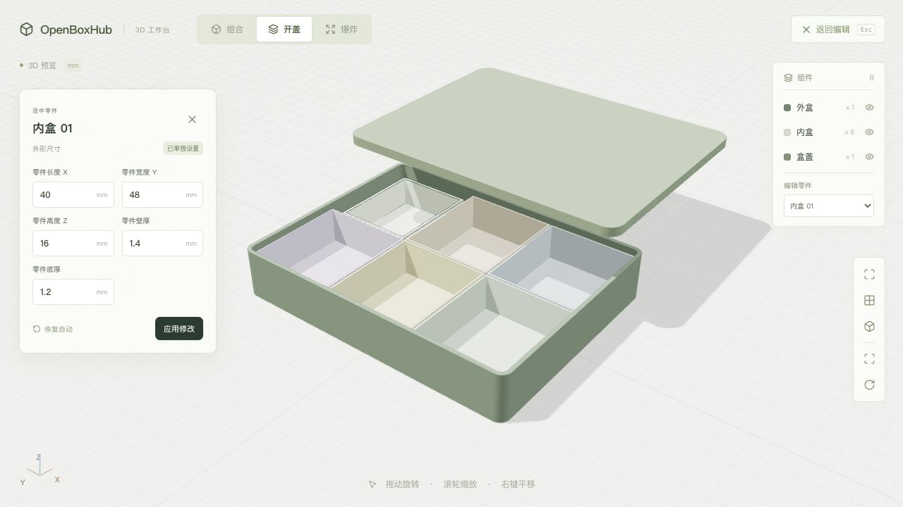
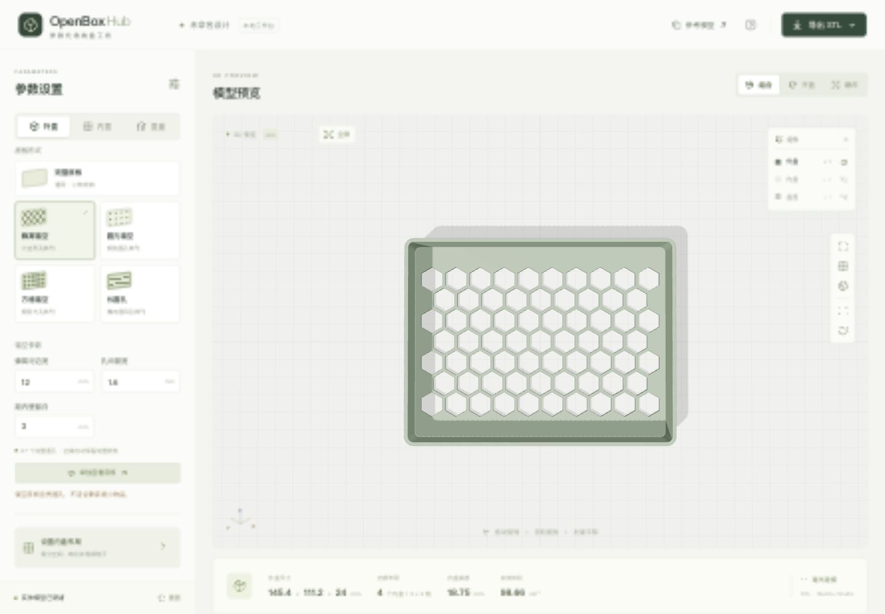
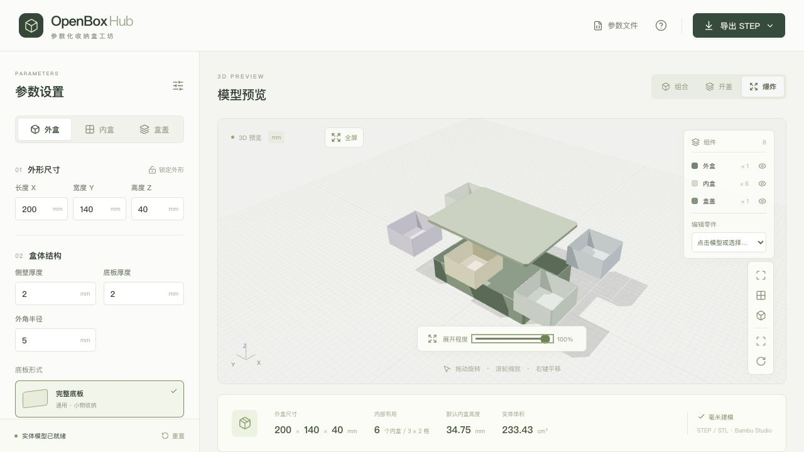
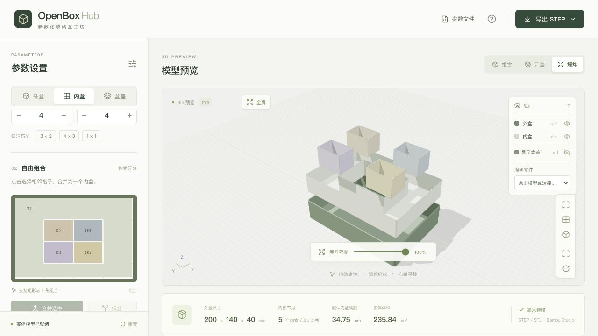

<div align="center">
  
  <h1>OpenBoxHub</h1>
  <p><strong>浏览器里的参数化收纳盒工坊</strong></p>
  <p>设置尺寸 · 组合内盒 · 导出打印</p>
  <p>
    <a href="https://geekheart.github.io/OpenBoxHub/"><strong>打开在线工作台 →</strong></a>
    &nbsp; · &nbsp;
    <a href="#快速开始">本地运行</a>
    &nbsp; · &nbsp;
    <a href="#部署">部署指南</a>
  </p>
  <p><code>纯前端</code> &nbsp; <code>独立零件编辑</code> &nbsp; <code>360° 预览</code> &nbsp; <code>STEP / STL / JSON</code></p>
</div>



先确定外盒尺寸，再按整数行列划分内盒，合并相邻格子、选择底板与盒盖，最后下载独立零件，交给 Bambu Studio 切片。

打开页面即可编辑参数。默认外盒为 **200 × 140 × 40 mm（外形尺寸）**，以现货飞机盒的 20 × 14 × 4 cm 规格作为尺寸起点，参考 [EPACKBOX 飞机盒规格](https://epackbox.com/products/mail-box-aircraft-box)。

建模、预览与文件生成全部在浏览器内完成。参数通过 JSON 文件保存与恢复，页面不保存历史记录，刷新后回到默认设计。

## 可以做什么

| 功能 | 说明 |
| --- | --- |
| 参数化外盒 | 调整长、宽、高、壁厚、底厚和圆角；锁定外形后继续设计内部布局 |
| 自由组合内盒 | 以 1–12 行 × 1–12 列整数等分，合并共边相邻格子，支持矩形、L 形与环形；合并后可拆分 |
| 可配置底板 | 实体、蜂窝、圆孔、方孔、长圆孔；调整孔宽、筋宽、内壁留边和长圆孔总长 |
| 可替换盒盖 | 开放式无盖、外套式盒盖、内嵌定位盖；单独切换盖型时共用同一套盒体 |
| 全屏 3D 预览 | 360° 旋转、缩放与平移；组合、开盖、爆炸视图，嵌套内盒自动分层展开，运动路径经过碰撞检查 |
| 装配查看 | 组件显隐、文字按钮隐藏/显示盒盖、外盒透明、自动旋转、俯视与正视、点击选择零件 |
| 独立零件编辑 | 点击外盒、内盒或盒盖，分别修改长、宽、高、壁厚与底厚；非矩形内盒显示外接矩形尺寸 |
| 参数文件 | 导入、导出 JSON，保存完整参数、合并布局、独立零件设置与外盒锁定状态 |
| 本地下载 | 默认 STEP，可选 STL；整套平铺单文件、独立零件 ZIP 或单个零件 |

## 从尺寸到结构

### 先等分，再合并

设定外盒后，在「内盒」中调整横向列数与纵向行数。点击共边相连的格子，再选择「合并选中」，就能生成一个独立、可取出的内盒。合并会真正移除格子之间的隔墙；需要调整时，选中已合并区域并「拆分」。仅对角接触的格子不能合并。



修改行列数会重置合并布局与内盒独立参数。合并或拆分时，仅重置参与调整的内盒，其余内盒保留原设置。

### 单独调整每个零件

点击 3D 模型中的零件，或使用「编辑零件」下拉框，在面板中调整长、宽、高、壁厚和底厚，点击「应用修改」。外盒锁定后，长、宽、高不可编辑；需要改变外形时先解锁。



L 形、环形等非矩形内盒显示外接矩形尺寸，修改长宽会绕原轮廓中心缩放，保留合并形状。盒盖的高度包含盖板与定位边，底厚对应盖板厚度。内盒与盒盖可点击「恢复自动」，重新使用全局参数生成。尺寸造成装配碰撞或越界时，界面会提示调整。

### 底板也由参数决定

在「外盒」中选择底板样式。孔洞由实体布尔运算生成，导出的 STEP 和 STL 同样包含贯通孔。孔宽、最小筋宽与距内壁留边分别可调，系统只保留完整孔洞，避免在边缘留下残缺孔形。选择「单独查看底板」可以检查孔阵列。



镂空作用于外盒底板，内盒保持实体底板。如果当前尺寸放不下完整孔洞，界面会提示并保留实体底板；过密孔阵列会提示调整参数。

### 从任何角度看清装配

页面默认显示参数面板和 3D 预览。点击「全屏」铺满窗口，按 `Esc` 或点击「返回编辑」回到参数面板。拖动旋转、滚轮缩放、右键平移，在「组合」「开盖」「爆炸」之间切换，查看每个零件如何放入外盒。爆炸程度默认 **100%**，可用滑条调整。



展开依次抬起盒盖、竖直取出内盒，再向外展开。普通等分内盒保持同层；回形、多重嵌套及 U/C 形开口凹槽中的内盒，会先升到更高层，再完整展开。即使内盒与凹槽同中心、没有相对径向位移，也会自动分层。程序检查整个运动路径；切换视图或中途反向时，零件经过共用的安全位置再继续移动。



右上角组件栏提供「隐藏盒盖 / 显示盒盖」文字按钮。隐藏后取景只包含可见零件，导出文件仍保留盒盖。

外套盖从盒体外侧套合；内嵌定位盖通过裙边进入内腔。自动生成的内盒统一预留 `定位边深度 + 盒盖单边配合间隙` 的顶部空间；独立内盒高度可在该预留后的可用范围内调整，并检查装配。

## 保存与恢复参数

打开「参数文件」，点击「下载 JSON」保存当前设计。文件包含外盒、底板、盒盖、格子分组、独立零件参数和外盒锁定状态。


点击「选择参数文件」可导入保存的 JSON，也支持 ZIP 中的 `design.json` 或 `manifest.json`。文件通过格式与建模校验后替换当前设计；导入失败时保留原设计。

页面不保存历史记录。离开或刷新前，请下载需要保留的参数文件。

示例参数：[默认 200 × 140 × 40 mm、3 列 × 2 行](examples/default_3x2/design.json)；[L 形合并与内嵌盖，145.4 × 111.2 × 24 mm](examples/merged_L_inset/design.json)。

## 导出与打印

默认导出为**整套平铺 STEP**，每个零件保留为独立实体。可切换为 STL，并选择整套单文件、独立零件 ZIP 或单个零件。文件由浏览器生成，点击「下载文件」即可保存。


STEP 使用现有闭合网格生成分面实体（`FACETED_BREP`），保留模型的面片精度，不恢复解析圆曲面或参数化特征。继续在 OpenBoxHub 编辑设计请保存 JSON。[OCCT STEP 文档](https://github.com/Open-Cascade-SAS/OCCT/blob/master/dox/user_guides/step/step.md)说明了这一实体类型。

ZIP 包含：

- 每个外盒、内盒及盒盖的独立 STEP 或二进制 STL，取决于所选格式。
- `design.json`：可重新导入的设计参数、格子分组与独立零件设置。
- `manifest.json`：参数、独立零件设置、零件信息与装配变换，也可用于导入。
- `README.txt`：打印方向、单位及切片说明。

**在 Bambu Studio 中：**

1. 导入 STEP 或 STL；ZIP 需先解压。使用整套单文件时，可拆分为**独立对象**再排盘。
2. 使用毫米与 100% 比例，根据实际打印机热床重新排盘。
3. 选择打印机、材料与切片参数，预览后再打印。

所有零件导出时底部均为 `Z = 0`：盒体开口朝上，盒盖平面朝下、定位裙边朝上。爆炸程度、视角、组件显隐与透明效果仅影响预览，不会改变导出几何。整套平铺文件提供通用排布，仍需在切片软件中核对平台尺寸。

STEP 记录毫米单位；STL 本身不记录单位，导入时请选择毫米。两者均不包含打印机或材料配置。默认盒盖单边配合间隙为 **0.25 mm**，内盒单边间隙为 **0.35 mm**，自动尺寸下相邻内盒之间为 **0.70 mm**。这些数值是试打起点，实际松紧需要结合材料、打印机与切片结果确认。

**尚未进行实物试打**，配合松紧请先用小尺寸试件确认。

## 快速开始

推荐使用 **Node.js 24** 与 **pnpm 11.19.0**。

```bash
git clone https://github.com/geekheart/OpenBoxHub.git
cd OpenBoxHub
npm install --global pnpm@11.19.0
pnpm install --frozen-lockfile
pnpm dev --port 5173
```

打开终端显示的地址，默认是 <http://127.0.0.1:5173/>。macOS 也可在安装依赖后双击项目中的 `启动盒子工坊.command`；保留该终端窗口即可持续运行。

## 部署

### GitHub Pages

在线地址：**[geekheart.github.io/OpenBoxHub](https://geekheart.github.io/OpenBoxHub/)**

仓库使用 [GitHub Actions 工作流](.github/workflows/pages.yml) 部署：推送到 `main` 或推送任意 tag 后，安装锁定依赖、运行测试、构建，再将对应提交的 `dist/` 发布到 GitHub Pages。也可以在仓库的 **Actions** 页面选择 `main` 或 tag 手动运行。PR 只测试与构建。

按 tag 发布示例（版本号按需修改）：

```bash
git tag v1.0.1
git push origin v1.0.1
```

仅在本地创建 tag 不会触发部署；需将 tag 推送到 GitHub。tag 对应的提交须包含此工作流。

部署自己的副本：

1. Fork 本仓库，或把代码推送到自己的 GitHub 仓库。
2. 进入 **Settings → Pages → Build and deployment**，将 **Source** 设为 **GitHub Actions**。
3. 在 **Settings → Environments → github-pages** 中允许 `main` 分支，以及 `*`、`**/*` 两个 tag 名称规则。
4. 在 **Actions** 页面启用并运行部署工作流，或向 `main` 推送提交、推送 tag。
5. 等待工作流完成，从 **Settings → Pages** 打开已发布地址。

Vite 使用相对资源路径，支持仓库子目录部署；Worker 和 Manifold WASM 随构建产物一起发布。

### 任意静态服务器

```bash
pnpm install --frozen-lockfile
pnpm build
```

把 **`dist/` 中的全部内容**上传到静态托管服务，保留目录结构。服务器应通过 HTTP/HTTPS 提供文件，并支持 `.wasm` 的 `application/wasm` 类型。

本地检查生产构建：

```bash
pnpm preview --port 4173
```

也可用普通静态服务器验证：

```bash
python3 -m http.server 8080 --bind 127.0.0.1 --directory dist
```

请通过 HTTP/HTTPS 打开页面。直接双击 `dist/index.html` 使用 `file://` 可能被浏览器阻止加载 Worker 或 WASM。

## 技术与开发

| 技术 | 负责什么 |
| --- | --- |
| [React](https://react.dev/) + [TypeScript](https://www.typescriptlang.org/) + [Vite](https://vite.dev/) | 参数界面、状态管理与静态构建 |
| [Three.js](https://threejs.org/) + OrbitControls | 实时 3D、相机交互与爆炸展示 |
| [Manifold WASM](https://manifoldcad.org/) | 轮廓合并、偏移、裁切和实体布尔运算，生成闭合网格 |
| Web Worker | 在独立线程中执行建模、运动路径碰撞检查与文件生成 |
| [JSZip](https://stuk.github.io/jszip/) | 在浏览器内打包 STEP/STL 零件与参数清单 |

```text
src/
├── App.tsx              # 参数、分组合并、界面与下载交互
├── PartInspector.tsx    # 选中零件的尺寸与厚度编辑
├── NumberField.tsx      # 数值输入
├── Scene.tsx            # Three.js 场景、视角与装配动画
├── geometry.ts          # 参数校验与 Manifold 实体建模
├── geometry.worker.ts   # WASM 初始化、后台建模与路径规划
├── collision.ts         # 基于实体截面的连续扫掠碰撞检查
├── motion.ts            # 共用运动路径、阶段切换与反向移动
├── design.ts            # 参数 JSON 校验、导入与导出
├── step.ts              # AP214 分面实体 STEP 序列化
├── export.worker.ts     # 后台生成下载文件
├── export.ts            # 格式选择、STL、平铺布局、ZIP 与清单
└── types.ts             # 参数、默认值与模型数据结构
tests/                  # 几何、装配、运动路径、参数文件与导出验证
docs/images/            # 实际界面截图
.github/workflows/      # GitHub Pages 部署
```

```bash
pnpm test     # 几何与导出测试
pnpm build    # TypeScript 检查与生产构建
```

测试覆盖闭合有向边、Float32 坐标焊接与退化面、尺寸与体积、装配与运动路径碰撞、独立零件编辑、盖型互换、L 形与环形合并、镂空孔阵列、参数文件往返与无效输入，以及无需网络的 STEP/STL/ZIP 导出。

开发约定见 [AGENTS.md](AGENTS.md)。
